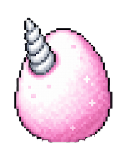
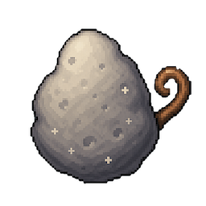
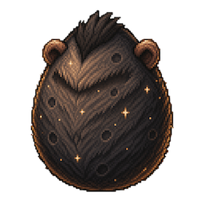

<div align="center">


# 真正的 AI 寵物養成

### 你的 AI 用得越認真,牠長得越神氣 🐣 → 🦄

[](https://github.com/ppXD/petpet/releases/latest)
[](https://github.com/ppXD/petpet/releases/latest)
[](https://github.com/ppXD/petpet/releases/latest)
[](https://github.com/ppXD/petpet/releases/latest)
[](LICENSE)

</div>

---

## 📦 安裝

到 [**Releases**](https://github.com/ppXD/petpet/releases/latest) 抓一個:

| 平台 | 檔案 | 一行指令 |
|---|---|---|
| 🍎 macOS | `petpet_*.dmg` | 拖進 `/Applications`,首次啟動跑 `xattr -cr /Applications/petpet.app` |
| 🐧 Debian / Ubuntu | `petpet_*_amd64.deb` | `sudo dpkg -i petpet_*_amd64.deb` |
| 🐧 RHEL / Fedora | `petpet-*-1.x86_64.rpm` | `sudo rpm -i petpet-*-1.x86_64.rpm` |
| 🐧 Portable | `petpet_*_amd64.AppImage` | `chmod +x petpet_*_amd64.AppImage && ./petpet_*_amd64.AppImage` |
| 🪟 Windows | `petpet_*_x64.msi` | 雙擊安裝 |

> macOS 沒有 Apple Developer 簽章,首次 `xattr -cr` 清除 quarantine 即可。

---

## 🐾 這是什麼?

petpet 是一隻活在你桌面上的小寵物,**靜靜聽 Claude Code / Codex / OpenCode / Aider 的 token 流動**,然後把你「真的在用 AI 做事」這件事餵成牠的成長。

- **零侵入**:不需要改 hook,啟動就自動接管已有的 session log
- **本地優先**:所有狀態存 `~/.petpet/`,沒有雲、沒有遙測
- **跨 provider**:同一隻寵物吃多個 AI 工具的 events,XP 統一累積

---

## 🦄 三個內建難度

| 模板 | 難度 | 默認名 | 大致破蛋時長 (Opus 4.7) | 滿級 L99 |
|:---:|:---:|:---:|:---:|---:|
| <br>**Unicorn** | 🟢 Easy | Sparkle | ~5-10 conv | 約 30 天 |
| <br>**Sun (Wukong)** | 🟡 Medium | Wukong | ~15-20 conv | 約 60 天 |
| <br>**KingKong** | 🔴 Hard | KingKong | ~30+ conv | 約 150 天 |

**Hard 模式 (KingKong) 的設計哲學**: 閒聊不會餵食。只有 token 用量、task 完成、subagent 派遣 才會推進進度條。想養大這隻獸,你得真的在用 AI 做事。

---

## 🔮 進化系統

每隻寵物有 **10 個 stage** (蛋 → 幼形 → 成長 → 最終形態),用 token + 活動事件累積 XP 來推進。

```
   Stage 0       Stage 1         Stage 5         Stage 9
     🥚    →     🐣      →   ✨ 中期形態 ✨ →    🌟 完全體 🌟
     L0          L1              L40              L99
   (egg)       (hatch)        (mid evolve)    (final form)
```

**XP 來源**:
- 🪙 **Usage events** — 每個 LLM 回應、按 token 加權
- 🎯 **Activity events** — `user_prompt` / `task_completed` / `subagent_stop` / `session_start`
- 🔧 **Manual grants** — CLI 直接餵 XP (admin / debug)

**算法核心**:`weighted_tokens / 60_000 × tier × confidence × growth_curve` → cap 後 × per-rule 多餘倍數 (見 [`src/xp/algorithm.rs`](src/xp/algorithm.rs))。

**Tier (模型強度)**:
- 🌌 **Frontier** (Opus, GPT-5, o1+): 1.5× 加成,單 event cap 10 XP
- 🌙 **Mid** (Sonnet, GPT-4o, Gemini): 1.0×, cap 6 XP
- 🐰 **Mini** (Haiku, mini, nano): 0.7×, cap 3 XP

**Growth curve**: 高等級 XP 自然遞減 (`1 / (1 + 0.02 × level)`),防止高活躍用戶秒滿級。

---

## 🐕‍🦺 多寵物 + 自訂模板

### 一台機器養多隻

切換 active 寵物隨時來。Active 寵物吃所有 live events,其他寵物保留 snapshot 不受影響。

### 自製寵物模板

內建的 **Template Creator** 讓你 3 分鐘做出一隻完全自訂的寵物:

1. 選一個 **levels preset** (short / medium / long curve)
2. 選 **stages preset** (simple 5-stage / balanced 7-stage / extended 10-stage)
3. 自訂:
   - 名字 + 描述 + flavor text
   - 10 個 stage 的 sprite 圖 (PNG, 拖進去就好)
   - Rules (每個 event type 給多少 XP, 哪個模型加成)
   - 主題色 + label chips

寵物模板存在 `~/.petpet/templates/<id>/`,純 JSON + PNG。可手 edit,可 git 管理,可分享給朋友。

---

## 📊 Dashboard

點寵物 → 開 Dashboard 看完整使用統計:

- 💰 **Feeding Bill** — 今日 / 本週 / 本月 / 終身的 USD 花費 + token 消耗
- 📈 **Per-day chart** — 30 天柱狀圖,看趨勢
- 🤖 **Per-model breakdown** — 每個模型用了多少 token、花了多少錢
- 📜 **Recent moves** — 寵物最近的 XP 紀錄,每筆都標記來源 (usage / activity / manual)
- ⏮️ **All / Just this pet 切換** — `All` 涵蓋安裝前就存在的歷史 session,作為「考古」視圖

Dashboard 自動同步:啟動 app 時觸發 historical import 把過去的 JSONL session 全部讀入 (不會給 active pet 加 XP, 純展示)。

---

## 📦 寵物 / 模板 匯出與匯入

把整隻寵物 (含 snapshot, XP 紀錄, 自訂名字) 或整個模板打包成 `.petpet` 壓縮檔,丟到 USB / Discord / GitHub Release,別人 import 後接著養。

```
Settings → Export Pet      → 產出 .petpet 檔
Settings → Export Template → 只打包 template 本體,不含 instance state
Settings → Import...       → 拖檔進來,自動驗證 schema + checksums
```

Import 時會嚴格驗證:
- ✔ Manifest schema version
- ✔ Sprite 完整性 (10 stages × PNG presence)
- ✔ XP curve monotonicity
- ✔ Rule shape (不接受未知 source_type)

不通過直接拒收,不會默默壞 state。

---

## ⚙️ 技術選型

| 層 | 用了什麼 |
|---|---|
| Desktop shell | Tauri 2 (Rust + WebView2/WKWebView) |
| Frontend | React 19 + Vite + TypeScript |
| 後端 / XP 引擎 | Rust (純 async,Tokio runtime) |
| Persistence | SQLite (WAL mode, 單 writer 序列化) |
| Event ingest | JSONL watcher + native hooks (HTTP local server) |
| 模型 registry | 遠端 GitHub-hosted JSON,啟動時 sync,離線可用 cache |

---

## 🛠️ 從原始碼建置

```sh
# 1. Install Rust + Node 22 + pnpm
# 2. Clone
git clone https://github.com/ppXD/petpet.git
cd petpet/desktop

# 3. Dev (hot-reload)
pnpm install
pnpm tauri dev

# 4. Release build
pnpm tauri build
# → desktop/src-tauri/target/release/bundle/
```

---

## 📄 授權

MIT.  寵物 sprite 與本 repo 程式碼皆可自由 fork、修改、商用。

---

<div align="center">
  Made with 🍓 by humans who use AI too much.
</div>
