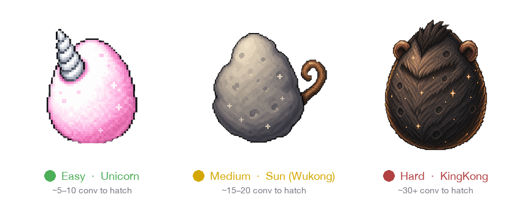
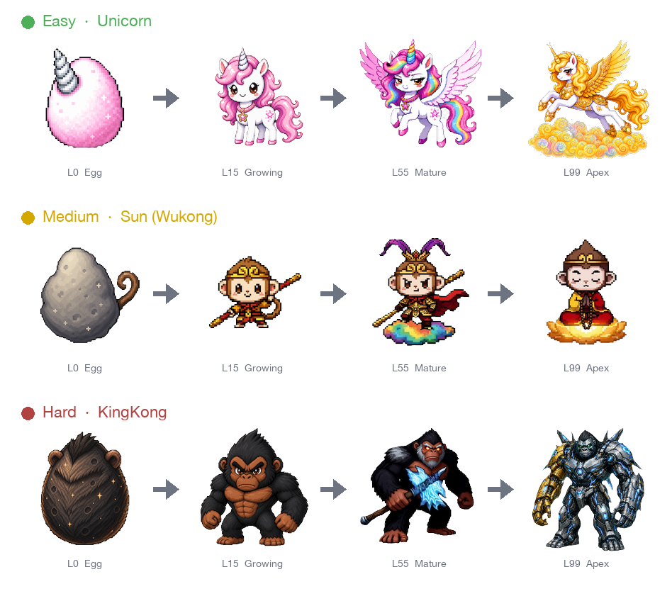

<div align="center">


<h1>petpet</h1>

<h3>Real AI Pet Raising</h3>

<p><i>The harder you work your AI — the mightier your pet becomes.</i> 🐣 → 🦄</p>

<p>
  <a href="https://github.com/ppXD/petpet/releases/latest"></a>
  <a href="LICENSE"></a>
  
</p>

</div>

<br>

<div align="center">

### 🥚 Pick your egg

<a href="https://github.com/ppXD/petpet/releases/latest"></a>
&nbsp;
<a href="https://github.com/ppXD/petpet/releases/latest"></a>
&nbsp;
<a href="https://github.com/ppXD/petpet/releases/latest"></a>

</div>

<br>

<details>
<summary><b>Install commands</b> (click to expand)</summary>

```sh
# 🍎 macOS — drag .dmg to /Applications, then clear quarantine on first launch:
xattr -cr /Applications/petpet.app

# 🪟 Windows — double-click the .msi (or _x64-setup.exe for the NSIS variant)

# 🐧 Debian / Ubuntu
sudo dpkg -i petpet_*_amd64.deb

# 🐧 Fedora / RHEL
sudo rpm -i petpet-*-1.x86_64.rpm

# 🐧 Portable (any distro, no install)
chmod +x petpet_*_amd64.AppImage && ./petpet_*_amd64.AppImage
```

</details>

<br>

###  🐾 What is petpet?

petpet is a desktop companion that quietly listens to **Claude Code / Codex / OpenCode / Aider** — and more providers landing soon — then turns your real AI usage into the pet's growth. Code seriously, your pet thrives. Idle, it sleeps.

- 🔒 **Zero-risk, fully local.** No cloud, no telemetry, no account, no data ever leaves your machine. Open source, MIT-licensed, fully auditable.
- 🪶 **Zero-setup.** No hook configuration. petpet auto-discovers existing session logs on launch.
- 🤖 **Multi-agent.** One pet eats events from every supported AI coding tool; XP accumulates in a single pool.
- 🗂️ **Multi-pet.** Raise a fleet — switch the active companion any time; the rest hold their state.

<br>

###  🦄 Three Built-in Difficulty Templates

<div align="center">



| | Template | Difficulty | Default name | Hatch (Opus 4.7) | L99 (heavy use) |
|:---:|:---:|:---:|:---:|:---:|:---:|
|  | **Unicorn** | 🟢 Easy | Sparkle | ~5–10 conv | ~30 days |
|  | **Sun (Wukong)** | 🟡 Medium | Wukong | ~15–20 conv | ~60 days |
|  | **KingKong** | 🔴 Hard | KingKong | ~30+ conv | ~150 days |

</div>

**Hard mode philosophy** — KingKong won't budge for idle chat. Only deliberate work counts: AI token usage, completed tasks, dispatched subagents. Want a titan? Earn it.

<br>

###  🔮 The Evolution Engine

Every pet has **10 evolution stages** — egg → newborn → six juvenile / adult forms → final apex form. XP accrues from real-world events; level thresholds gate visual transformations.

<div align="center">
  
</div>

**The XP pipeline**

```
  ┌─────────────────────────────────────────────────────┐
  │  Token usage  ─┐                                    │
  │  Activity hooks├─→ Algorithm ─→ Rule multiplier ─→ XP
  │  Manual grants ┘   (cross-pet     (per-template       │
  │                     invariant)     personality)        │
  └─────────────────────────────────────────────────────┘
```

**Algorithm core** (`src/xp/algorithm.rs`, version-pinned, cross-install identical):

```text
weighted = input·1 + output·5 + reasoning·5 + cache_create·1.25 + cache_read·0.1
raw      = weighted / 60,000 × tier_mult × confidence × growth_curve(level)
xp       = round(raw).clamp(0, tier_cap)
```

**Tier multipliers** — capability bands stay stable across vendor price changes:

| Tier | Examples | Mult | Per-event cap |
|---|---|:---:|:---:|
| 🌌 Frontier | Opus 4.7, GPT-5, o1+ | 1.5× | 10 XP |
| 🌙 Mid | Sonnet, GPT-4o, Gemini 2.5 | 1.0× | 6 XP |
| 🐰 Mini | Haiku, GPT-4o-mini, nano | 0.7× | 3 XP |

**Growth curve** — `1 / (1 + 0.02 · level)`. High levels naturally diminish: at L25 you earn 67% per event, at L50 only 50%. No way to whale-rush to L99 in a weekend.

**Per-template personality** — rule multipliers `[0.5, 2.0]` let each template flavor its preferences. Unicorn rewards every chat (chat-friendly), Sun halves it (medium pacing), KingKong zeros it out (token-only diet).

<br>

###  🐕‍🦺 Multi-Pet & Custom Templates

**Switch any time.** The active pet absorbs live events; the rest preserve their state forever. Run a parallel breeding program if you like.

**Roll your own pet.** The built-in **Template Creator** gets you from blank to playable in under 3 minutes:

1. Pick a **levels preset** — `short` / `medium` / `long` XP curve
2. Pick a **stages preset** — `simple` (5 stages) / `balanced` (7) / `extended` (10)
3. Fill in:
   - Name, description, flavor text
   - 10 sprite PNGs (drag-and-drop)
   - Per-rule XP weights and per-model boosts
   - Theme color + label chips

Templates live at `~/.petpet/templates/<id>/` — pure JSON + PNGs. Hand-edit, git-version, share with friends. No proprietary format anywhere.

<br>

###  📊 Dashboard

Click your pet → opens a usage dashboard packed with:

- 💰 **Feeding Bill** — today / this week / this month / lifetime USD + token totals
- 📈 **30-day chart** — daily spend trend, see your AI habits at a glance
- 🤖 **Per-model breakdown** — which models you've fed your pet, and how much
- 📜 **Recent moves** — every XP gain logged with source (`usage` / `activity` / `manual`)
- ⏮️ **All vs single-pet toggle** — `All` includes pre-install historical sessions (display-only, no retroactive XP)

On launch, petpet performs **async historical import** of past session logs — your dashboard isn't empty on Day 1.

<br>

###  📦 Pet & Template Sharing

Pack any pet (snapshot + XP history + custom name) or any template into a `.petpet` archive. Toss it on USB / Discord / GitHub releases. The recipient imports, schema is validated end-to-end:

```
✓ Manifest schema version       ✓ Sprite completeness (10 × PNG)
✓ XP curve monotonicity         ✓ Rule shape (no unknown source_type)
✓ SHA-256 checksums             ✓ No path traversal in archive
```

Invalid archives are **rejected**, never silently importing broken state.

<br>

###  🛠️ Build from Source

```sh
# Prerequisites: Rust toolchain, Node 22+, pnpm

git clone https://github.com/ppXD/petpet.git
cd petpet/desktop

pnpm install
pnpm tauri dev          # hot-reload dev build

# Release bundles → desktop/src-tauri/target/release/bundle/
pnpm tauri build
```

<br>

###  📄 License

MIT — see [LICENSE](LICENSE). Fork it, modify it, ship it commercially. Pet sprites and engine code all under the same hat.

<br>

<div align="center">

Made with 🍓 by humans who use AI too much.

</div>
